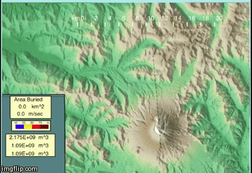
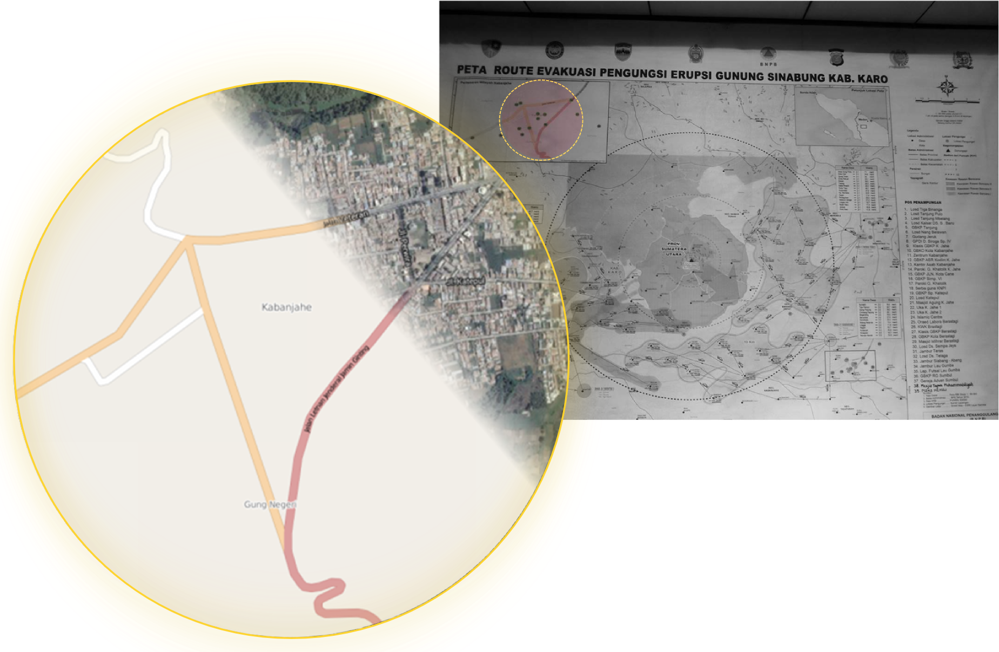
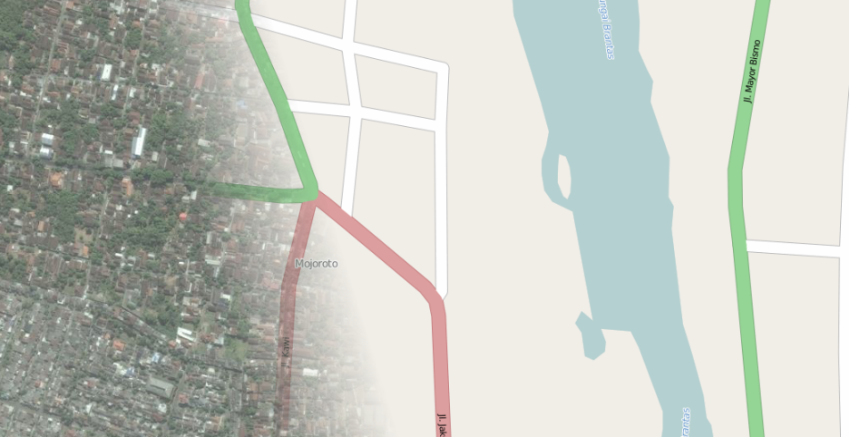
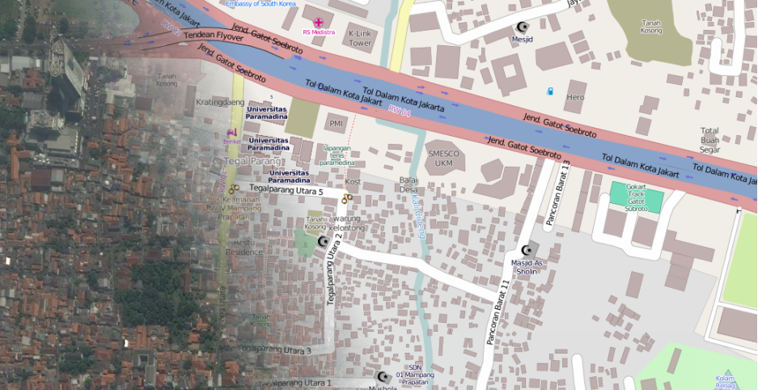
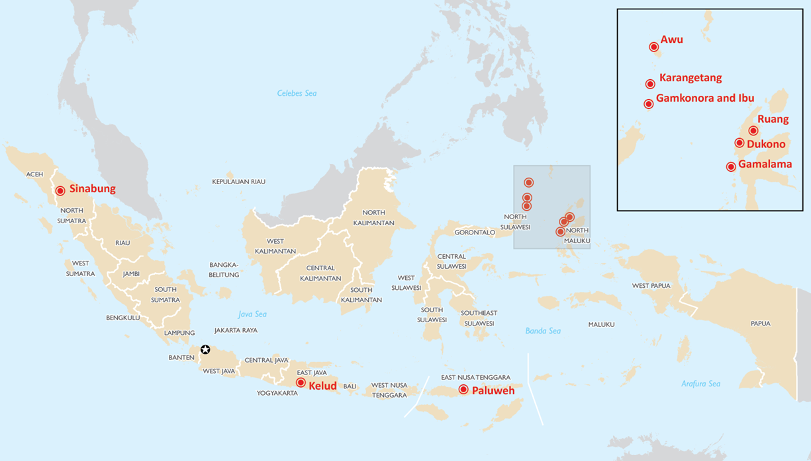
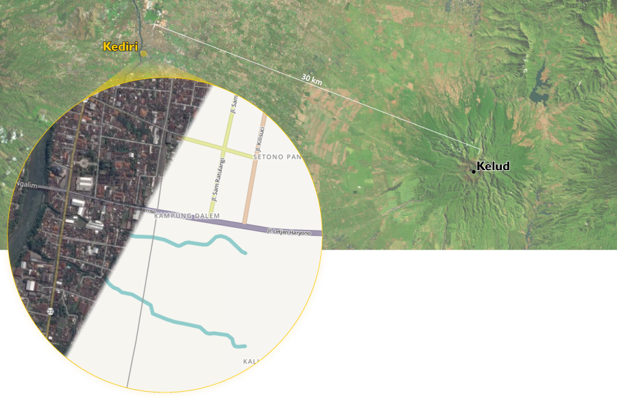

While integral for community resilience, detailed information on critical infrastructure is often missing when disaster strikes. Data of this nature is critical for communities, the private sector, and governments when it comes time to integrate climate change adaptation and Disaster Risk Reduction (DRR) into their planning processes. This problem is especially evident in Indonesia. 

### Data is Important

Data about nearby communities helps develop an assessment of volcanic risk and can assist in the formulation of a hazard mitigation/response plan. Pre-disaster, it is both important and beneficial to have a plan for emergency response activities during all stages of the response.

When current population estimates are not available, the number of buildings can be used to estimate the population at risk for a particular hazard. This is critical to know before the onset of a disaster because these types of estimates are often used as inputs for many emergency planning decisions, such as proportioning budgets or prepositioning aid supplies.

Basic infrastructure data is also critical in identifying specifically what is at risk. For several years USAID has worked with the United States Geological Survey (USGS) and local scientific agencies to develop and implement sophisticated software used in modeling volcanic hazards. Programs like [LaharZ](http://pubs.er.usgs.gov/publication/ofr98638 "USGS Publication") can model inundation zones of the mud and ash slurry (called lahars) that flow from a volcano. The value of this model is only as good as the data that is being fed into it. 

<!--

*Animation of Mount Saint Helen eruption simulation by Steven N. Ward.*

-->

### Missing Data in Action

The training map below, created by the Indonesian National Agency for Disaster Management (BNPB), exemplifies issues with data accessibility. The inset of the map highlights the town of Kabanjahe: only showing a minimal set of intersecting roads. This belies the fact that Kabanjahe is a vibrant town filled with buildings, markets, schools, and people, the reality of which is made very obvious in the satellite imagery within the circular overlay. In fact, Kabanjahe is the seat of local government and the trade center of Karo Regency!  

*Photo of Kapanjahe evacuation exercise training by Harlan Hale of USAID/OFDA.* 

Because the above map was used for a training exercise, it should include much more detailed information (buildings, markets, etc). Despite the multiple use cases for infrastructure data in emergency management pre- and post-disaster, disaster management agencies often find that data available to them is outdated, inaccessible, bad quality, or non-existent. 

### Restricted Available Data

Today, anybody with a computer or smartphone can easily see spatial data about our world exists at a much larger and more accurate scale than any time in the past. This data, however, is usually proprietary and therefore is inaccessible or commercial data. So this wealth of visually available information cannot be used when creating any kind of map, disaster related or otherwise. Additionally, the data that is available commercially (for profit) generally is not spread evenly across the globe, and also is usually less available pr non-existant in less developed regions where commercial data providers have less incentive to travel. 

### New Opportunities using OpenStreetMap

[OpenStreetMap](http://www.openstreetmap.org/node/540924177#map=15/3.0991/98.4919 "Web map created with OSM data and focused on Kabanjahe")(OSM) has changed the dynamic of who can take an active role in deciding what should be on maps and in our global commons by providing a means of creating free community driven data sources. In doing so it has provided a platform that has humanitarian value, and thus is useful for all actors involved in humanitarian response. 

For more in depth information on OSM, there are many resources available online where you can read more about [what OSM is](http://derickrethans.nl/what-is-openstreetmap.html "Blog post by Derick Rethans"), [why it is important to humanitarian response](https://www.youtube.com/watch?v=H2kvyhM6U38#t=203), and [how to contribute](http://mapgive.state.gov/ "The Department of State MapGive Project"). In a broad sense, OSM is a shared repository of open and free spatial data. Anybody to contribute to and make use of the platform. OSM has garnered significant interest and investment from humanitarian agencies such as the Department of State/HIU, American Red Cross, USAID, and the World Bank--all of which see the potential for this platform to fill humanitarian data needs.   

The first most famous OSM use for humantarian purposes was in 2010, with mass volunteer efforts that created data for Haiti, especially Port-Au-Prince, after a 7.0 magnitude earthquake devastated the city and surrounding areas.  

<iframe src="https://player.vimeo.com/video/9182869" width="560" height="500" frameborder="0"></iframe>

As you can see in the video above, the earthquakes devastation focused global attention on the situation and caused a push for numerous volunteers across the globe that produced not only the best spatial data for Port-Au-Prince, but also the best spatial data for *any* city - ever. The volunteers' mapping efforts therefore brought immense value to disaster response situations, evidenced by its wide use among international response organizations. 

Since 2010 OSM efforts like this have become common, with various humanitarian organizations actively promoting and participating in them. 

<!--
Here are a few recent examples: 

* Department of State's Humanitarian Information Unit (HIU) collaborated with the International Red Cross (IFRC) and Humanitarian OpenStreetMap Team (HOT) to perform [damage assessments](http://bit.ly/1wMBS37) in Tacloban after cyclone Yolanda (Haiyan).

* HIU and IFRC also collaborated to map communities in West Africa affected by the [Ebola outbreak](http://bit.ly/ZeRWj2). 

Mapping parties look very different depending on what needs to be mapped and the level of local knowledge needed. Sometimes they require extensive training support or some level of local knowledge, whereas sometimes basic technological and local knowledge is sufficient for participants to contribute to the map. In the latter case, infrastructure around volcanoes is generally easy enough to trace from satellite imagery that there is little technical skill needed for volunteers to participate.

These efforts are often associated with early onset disasters that generate media attention and drive volunteers to participate. While these efforts have generated a lot of good and useful data, there is still a long way to go and many areas around active volcanoes thare still are not mapped - whether accurately or with enough data. 

*Bing Map Imagery and OpenStreetMap Image of Kediri and Jakarta, respectively. The dark tan polygons are descriptions of Jakarta’s buildings which were added to OSM.*

Between 1980 and 2008, approximately 300,000 Indonesians were affected by volcanic hazards at a cost of $160 million USD. With more than 75% of Indonesians live within 100 km of the country's 129 active volcanoes - the world's largest number of volcanoes within a country and within such a small geographic area - these numbers are not surprising.  In order to assist the humanitarian response community's capacity to plan and respond to volcanic hazards in Indonesia, USAID OFDA is promoting participatory mapping of critical infrastructure using OpenStreetMap. 

-->

### The Indonesian Volcano Project

The severe lack of available data around Volcanoes in Indonesia was highlighted by OFDA’s Volcano Disaster Assistance Program (VDAP) as a particular challenge to its ability to model the risks posed by volcanic hazards in these areas. VDAP is interested in creating data for these vulnerable areas and working with their counterparts in Indonesia in order to create better data to improve hazard assessments. They have highlighted 10 priority volcanoes:

<table>
  <thead>
    <tr>
      <th>Volcano Name</th>
      <th>Location</th>
    </tr>
  </thead>
  <tbody>
    <tr>
      <td>Kelud</td>
      <td>East Java</td>
    </tr>
    <tr>
      <td>Paluweh</td>
      <td>East Nusa Tenngara</td>
    </tr>
    <tr>
      <td>Sinabung</td>
      <td>Sumatra</td>
    </tr>
    <tr>
      <td>Karangetang</td>
      <td>North Sulawesi</td>
    </tr>
    <tr>
      <td>Awu</td>
      <td>North Sulawesi</td>
    </tr>
    <tr>
      <td>Ruang</td>
      <td>North Sulawesi</td>
    </tr>
    <tr>
      <td>Dukono</td>
      <td>Molluccas Islands</td>
    </tr>
    <tr>
      <td>Gamalama</td>
      <td>Molluccas Islands</td>
    </tr>
    <tr>
      <td>Gamkonora</td>
      <td>Molluccas Islands</td>
    </tr>
    <tr>
      <td>Ibu</td>
      <td>Molluccas Islands</td>
    </tr>
  </tbody>
</table>

*Location of all volcanoes listed in the table above.*

The long-term plan is to map all populated areas within a 50km radius of each of the volcanoes. Exactly how much work is needed for each volcano will depend on the surrounding areas. See the volcano pages for more information.

### Choosing Indonesian Volcanoes

As a nation made up of thousands of volcanic islands, most of the cities are located within close proximity to active volcanoes. Since 1980, approximately 300,000 Indonesians have been affected with an annual cost of almost $6 million ([source](http://www.preventionweb.net/countries/idn/data/)).

Residents of these islands must worry about more than volcanic hazards alone. Most islands are shaped by mountain ranges, forcing many to live in lower elevation areas. Lower elevations are especially susceptible to frequent landslides and floods, causing these communities to be constantly at risk. Regular flooding is the most frequent type of natural hazard in the country and costs Indonesia $2.3 million a year, making flooding the second most costly natural hazard to the country ([source](http://www.irinnews.org/fr/report/97861/indonesia-s-natural-disaster-risks-costs-rise)).

Volcanic hazards are also closely related to earthquake risk. Earthquakes are the second most frequent natural hazard that occur within Indonesia and account for the most fatalities by a wide margin ([source](http://www.preventionweb.net/countries/idn/data/)). While they cost the country several million a year, they are similiar to floods in that earthquakes occur frequently and have the ability to quickly damage a wide area. The damages cause economic ripples in the affected communities that can take years to recover from, if ever.

Individually, each of these natural hazards can be devastating by themselves, but more often than not, they occur simultaneously: posing a very high multi-hazard risk to residents near volcanoes. The large Indonesian cities that are unavoidably nestled against these island volcanoes thus present a major problem for disaster management agencies that already struggle to mitigate risks for singular disasters.